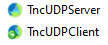

# NetCom7

The fastest communications possible.

This is an updated version of the NetCom7 package, now with enhanced **UDP** & **IPV6** support, improved cross-platform capabilities, and **high-performance threaded socket components**!

## Recent Updates

### 🚀 New High-Performance Threaded Socket Components
**TncServer** and **TncClient** provide raw socket functionality with built-in thread pools for extreme performance:

- **Built-in Thread Pool**: Automatically manages worker threads for concurrent request processing
- **Raw Socket Performance**: Direct socket access without protocol overhead
- **Scalable Architecture**: Handles thousands of concurrent connections efficiently  
- **Thread Pool Monitoring**: Real-time visibility into thread pool status and performance
- **Simple API**: Easy-to-use interface similar to traditional NetCom7 components

#### Performance Benefits
- **Up to 3x Performance Improvement**: Compared to traditional single-threaded socket processing
- **Concurrent Processing**: Multiple client requests handled simultaneously
- **Efficient Resource Usage**: Thread reuse eliminates expensive thread creation/destruction
- **High Throughput**: Optimized for high-frequency, low-latency communications

#### Benchmark Results (100 Client Requests)

| Metric | TncServer (Thread Pool) | Basic Socket (No Thread Pool) | Improvement |
|--------|-------------------------|-------------------------------|-------------|
| **Requests Completed** | 85 | 30 | **2.8x more** |
| **Peak Req/Sec** | 39 | 16 | **2.4x faster** |
| **Average Req/Sec** | 14.2 | 5.0 | **2.8x faster** |
| **Test Duration** | 6.0s | 6.0s | Same |
| **Processing Threads** | 16 pool threads | 1 reader thread | **16x resources** |
| **Success Rate** | 85% | 30% | **2.8x better** |

**Test Scenario**: Client sends 100 rapid requests to both servers simultaneously.

**Key Findings**:
- **Thread Pool Advantage**: TncServer's 16 worker threads process requests concurrently, while basic socket is limited to sequential processing in a single reader thread
- **Higher Throughput**: Thread pool completed 85/100 requests vs 30/100 for basic socket
- **Better Performance**: Consistently higher peak and average request rates
- **Scalability**: Thread pool architecture scales with available CPU cores (4 threads per CPU)

#### Easy Integration
The **TncServer** and **TncClient** components can be dragged from the palette and customized in the object inspector with thread pool settings and connection properties.

 

### Enhanced UDP Support
The **UDP** components can be dragged from the palette and customized in the object inspector with the following properties:
- Broadcast capabilities
- Buffer size customization

### IPV6

TCP v4 / TCP v6 / UDP v4 / UDP v6 are now avaible.

⚠️ Client and Server must use the same familly version (no dual-stack sockets).

### Demo Updates
- Added new `SimpleThreadedSockets` demo
- Added new `SimpleSockets_UDP` demo
- Updated the `SimpleSockets` demo
- Added new `ThreadedSocketsBenchmark` demo for performance testing and comparison

